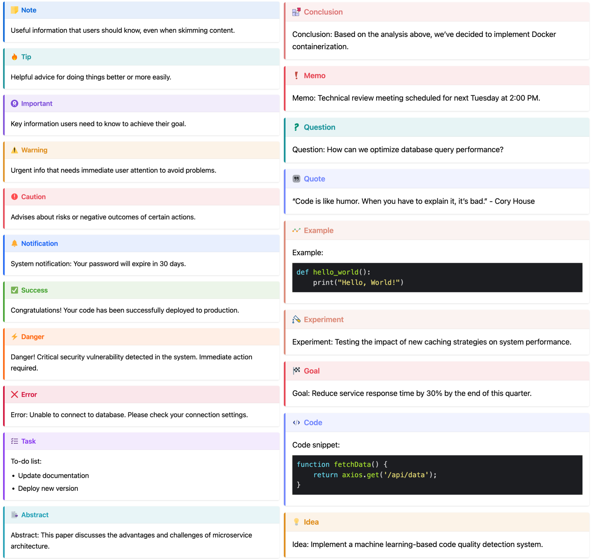
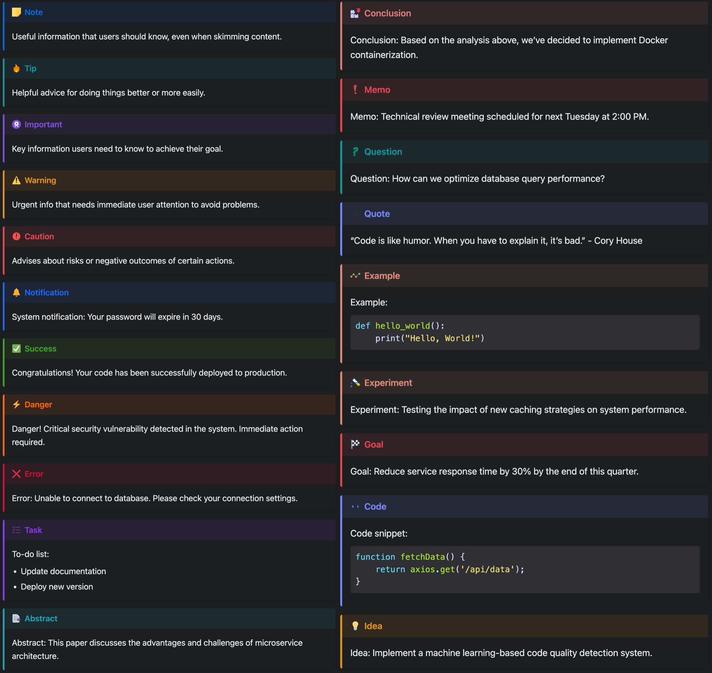
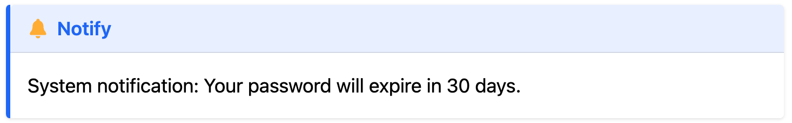
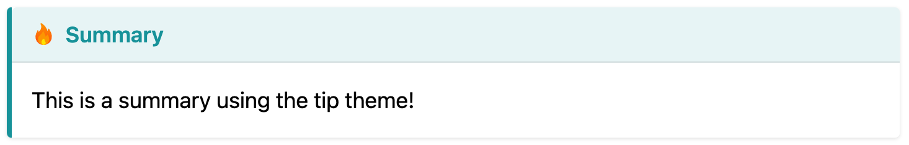

# hugo-admonitions

Simple admonitions for hugo.

Inspire from [mdbook-admonish](https://tommilligan.github.io/mdbook-admonish/)


## Features ✨

- Various beautiful and simple callout available 🎨
- Dark mode support 🌙
- Blockquote style 💬
  - Portable Markdown style (GitHub, Obsidian, Typora, etc.) 📝


## Overview of all admonitions

### Light Mode



### Dark Mode



## Installation

1. Inside the folder of your Hugo site, run:

```bash
git clone git@github.com:KKKZOZ/hugo-admonitions.git themes/hugo-admonitions

```

2. Add `hugo-admonitions` as the left-most element of the theme list variable in your site's or theme's configuration file `hugo.yam`l or `hugo.toml`.

    Example, with `hugo.yaml`:

    ```yaml
    theme: ["hugo-admonitions", "my-theme"]
    ```

    or, with `hugo.toml`,

    ```toml
    theme = ["hugo-admonitions", "my-theme"]
    ```

## Usage

Use the blockquote in this way:

```markdown
> [!NOTIFY]
> System notification: Your password will expire in 30 days.
```



Available callouts:

- `[!TIP]`
- `[!NOTIFY]`
- `[!SUCCESS]`
- `[!WARNING]`
- `[!DANGER]`
- `[!ERROR]`
- `[!TASK]`
- `[!ABSTRACT]`
- `[!CONCLUSION]`
- `[!MEMO]`
- `[!QUESTION]`
- `[!QUOTE]`
- `[!EXAMPLE]`
- `[!EXPERIMENT]`
- `[!GOAL]`
- `[!CODE]`
- `[!IDEA]`

Or you can customize the title by using any of them:

```markdown
> [!TIP] Summary
> This is a summary using the tip theme!
```


